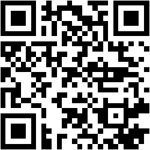

# [QR Generator](https://qr-generator-nine.vercel.app/) 
----
This is a website which creates QR Code for any Emails, Phone Numbers, URLs or normal texts. 

### What tech did I use to make this ⚙️?
- [React JS](https://reactjs.org/)
- [GoQR API](https://goqr.me/api/)

### Futures Updates:
- I'll try to make the website more appealing and more interactive.
- Implementation of a `download as JPG/PNG` button.

### How to download the QR Code 🔽?
- <b> Download QR on iPhones: </b> Long Press on the QR Code and
              click on 'add to photos'.
-  <b> Download QR on Android: </b> Long Press on the QR Code and
              click on 'download image'.
- <b> Download QR on PC/MAC: </b> Right Click on the QR Code and
              click on 'save image as'.

### QR Code of the Website

 
[Link to the website](https://qr-generator-nine.vercel.app/)